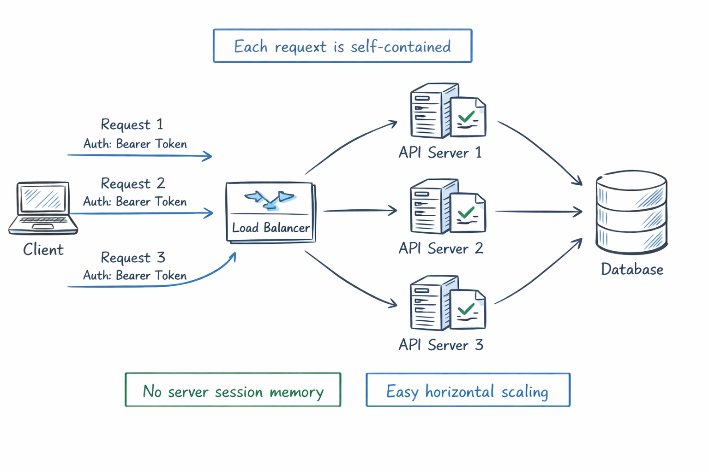
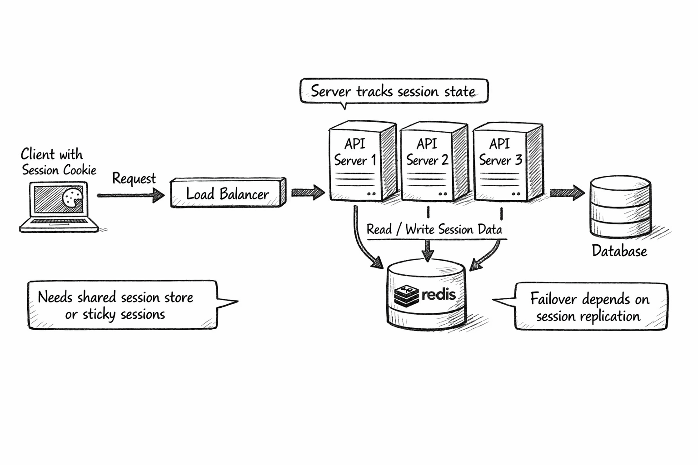
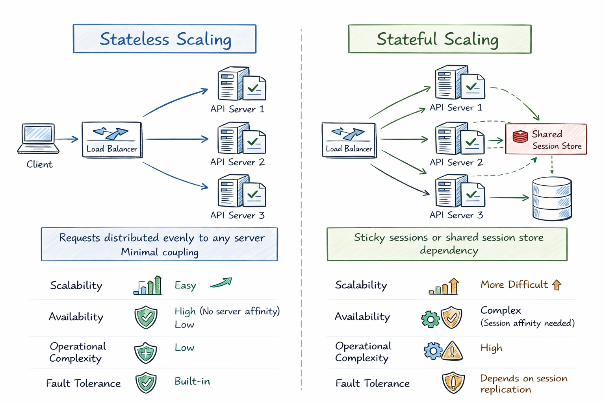

# RESTful, Stateful vs Stateless

This note explains the difference between stateful and stateless communication, how REST relates to statelessness, and how to choose the right approach in real systems.

## Table of Contents

- [1. Introduction](#1-introduction)
- [2. What is State?](#2-what-is-state)
- [3. What is Stateless?](#3-what-is-stateless)
- [4. What is Stateful?](#4-what-is-stateful)
- [5. What Does RESTful Mean Here?](#5-what-does-restful-mean-here)
- [6. RESTful vs Stateful vs Stateless (Quick Comparison)](#6-restful-vs-stateful-vs-stateless-quick-comparison)
- [7. Authentication Patterns](#7-authentication-patterns)
- [8. Scaling and Reliability Trade-offs](#8-scaling-and-reliability-trade-offs)
- [9. Common Misconceptions](#9-common-misconceptions)
- [10. When to Use Which Approach](#10-when-to-use-which-apcoach)
- [11. Real-world Scenarios](#11-real-world-scenarios)
- [12. Summary](#12-summary)
- [13. Self-check Questions](#13-self-check-questions)

---

## 1. Introduction

People often ask: "RESTful is stateless, but my app has login and user sessions. Is that a contradiction?"

Short answer: not necessarily.

- REST requires stateless communication between client and server.
- Your system can still keep state in databases, caches, or other services.
- The key is where the conversational state is stored and how each request is handled.

This document clarifies that distinction so you can design APIs with fewer mistakes.

## 2. What is State?

State is information needed to continue a process correctly.

Examples:

- User identity (who is making the request)
- Shopping cart contents
- Current step in a checkout flow
- Temporary server-side session data

In web systems, state can be held in several places:

- Client-side (browser memory, local storage, cookie)
- Server-side memory/session store (in-memory map, Redis)
- Durable storage (database)

The stateful/stateless question is mostly about request handling, not whether data exists at all.

## 3. What is Stateless?

A stateless interaction means each request contains all context required to process it.

Server behavior:

- Does not rely on per-client session memory from previous requests.
- Can serve request N without seeing request N-1.
- Treats each request independently.

Typical characteristics:

- Easier horizontal scaling (any instance can handle any request)
- Better load balancer flexibility
- Simpler failover behavior
- More request payload/context overhead

Simple example:

```http
GET /api/orders/123
Authorization: Bearer <token>
```

The token and request data provide enough context to process the request.



## 4. What is Stateful?

A stateful interaction means the server keeps client-specific context between requests.

Server behavior:

- Stores session/conversation data across calls.
- Future requests depend on stored server context.

Typical characteristics:

- Can reduce repeated context transfer from client
- Session workflows can feel straightforward
- Harder to scale across many instances unless session sharing is added
- More complexity for failover and recovery

Simple example:

```http
POST /login
```

Server creates session `S123`, stores it, returns cookie `session_id=S123`.
Next requests depend on that stored session.



## 5. What Does RESTful Mean Here?

REST (Representational State Transfer) is an architectural style. One of its key constraints is stateless client-server communication.

In practical API terms:

- Every HTTP request should be understandable on its own.
- Server should not depend on hidden conversational context from prior requests.

Important distinction:

- REST is stateless at the interaction level.
- REST does not mean "no data persistence".
- REST does not mean "database-less".

You can have a RESTful API that updates database state. What you should avoid is requiring hidden server session context to interpret requests.

## 6. RESTful vs Stateful vs Stateless (Quick Comparison)

| Aspect | Stateful | Stateless | RESTful API Expectation |
| --- | --- | --- | --- |
| Request independence | Low | High | High |
| Server session memory | Usually yes | Usually no | Prefer no per-client session dependence |
| Horizontal scaling | Harder | Easier | Easier |
| Failover handling | More complex | Simpler | Simpler |
| Network payload size | Smaller per request | Often larger per request | Accept larger if needed for self-contained requests |
| Caching friendliness | Lower | Higher | Higher (when resources and headers are designed well) |
| Typical fit | Conversational protocols | Web APIs/microservices | Resource-oriented HTTP APIs |

## 7. Authentication Patterns

Authentication is where people most often mix up "stateful" and "stateless".

### 7.1 Stateful Auth (Session-based)

Flow:

1. User logs in.
2. Server creates session in server-side store.
3. Client gets session cookie.
4. Each request sends cookie; server looks up session.

Pros:

- Easy revocation (delete session)
- Immediate server control over active sessions

Cons:

- Requires session infrastructure
- Cross-instance coordination needed

### 7.2 Stateless Auth (Token-based)

Flow:

1. User logs in.
2. Server issues signed token (often JWT).
3. Client sends token on each request.
4. Server validates token signature and claims.

Pros:

- Good fit for stateless APIs
- Easier scaling without centralized session lookup

Cons:

- Revocation can be harder before token expiry
- Token size and security hygiene matter

### 7.3 Hybrid Auth (Common in Production)

Many systems combine both:

- Stateless short-lived access token
- Stateful refresh-token/session control for rotation and revocation

This gives better scale while keeping security control points.

## 8. Scaling and Reliability Trade-offs

### Stateless-first scaling benefits

- Any API instance can handle any request.
- Auto-scaling groups work naturally.
- Rolling deployments are simpler.

### Stateful scaling challenges

- Need sticky sessions, or
- Need shared distributed session store, and
- Need session replication/failover strategy.

### Latency perspective

- Stateless may spend more bytes per request.
- Stateful may spend extra time reading session store.

Real performance depends on your workload and infrastructure.



## 9. Common Misconceptions

1. "REST means no state anywhere."
   - Incorrect. REST forbids hidden conversational state between requests, not persistent data.

2. "JWT always means better security."
   - Not always. Token misuse, poor expiry, or bad storage can create serious risk.

3. "Stateful is always bad."
   - Not true. Some domains naturally need server-managed session context.

4. "Stateless means no authentication."
   - Incorrect. Auth is still required; it is just carried per request.

## 10. When to Use Which Apcoach

Choose mostly stateless when:

- Building public/internal HTTP APIs
- Expecting large horizontal scale
- Running in cloud-native or microservice environments

Choose stateful when:

- Real-time conversational workflows need server continuity
- You need strict instant session invalidation with tight controls
- Protocol naturally models continuous connection context (e.g., some WebSocket use cases)

Choose hybrid when:

- You want stateless request handling plus centralized control for sensitive session lifecycle events.

## 11. Real-world Scenarios

### 11.1 E-commerce API

- Product catalog endpoints: stateless REST.
- Cart and checkout: often implemented with persisted resource state; still can be RESTful if requests are self-contained.
- Auth: commonly hybrid.

### 11.2 Chat Application

- Message history endpoints: stateless REST APIs.
- Live messaging channel: often stateful connection semantics (WebSocket).

### 11.3 Internal Microservices

- Usually stateless request/response for easier deployment and recovery.
- Shared persistent state in DB/event log.

## 12. Summary

- Stateful vs stateless is about interaction model and request dependency.
- RESTful systems should use stateless client-server communication.
- Stateless APIs generally scale and recover more easily.
- Stateful patterns are still valid where conversational continuity is essential.
- Hybrid strategies are common in production-grade systems.

## 13. Self-check Questions

1. Why can a RESTful API still update database state while staying stateless?
2. What operational issues appear when scaling session-based stateful services?
3. Why is token revocation often harder in purely stateless auth?
4. In your current project, which endpoints are good candidates for stateless design?
5. Which parts, if any, truly need server-managed conversational state?

---

*Tip: Revisit this note after implementing one auth flow and one scaling strategy. The concepts become much clearer with hands-on experience.*
